# ResearchLog

The following is a log of research done under the Cat's grant 2024.

## 01.07.2024 - 15.07.2024

In the past weeks I've developed an approach to build prototypes with arbitrarily flexible parts. The approach looked promising on CIFAR10. I've done initial experiments on the [CUB_200_2011](https://data.caltech.edu/records/65de6-vp158) dataset (fine-grained bird classification) with ResNet34 taken as the encoder network. The initial accuracy 75% is worse than the baseline 82% accuracy of fine-tuned ResNet and then the 80% accuracy of the original ProtoPNet but this is just a starting point (I trained with just 20 epochs and with a single augmentation - RandomHorizontalFlip)

The original paper (and many following papers) use a fixed augmentation set which is 30x bigger then the base training dataset. The augmentations consist of small rotations, small zoom-ins and random horizontal flips. I have an intuition that those augmentations are redundant and the only relevant one is the horizontal flip. My experiments on ResNet34 confirm this intuition. The full augmentation set might help to boost the metrics but for rapid prototyping RandomHorizontalFlip seems good enough.

The former papers on ProtoPNets use ResNets (among others) as encoders. But ResNets have [large receptive fields](https://gist.github.com/samson-wang/a6073c18f2adf16e0ab5fb95b53db3e6). This means that the 7x7 feature map produced by ResNets can hardly be interpreted as a map of local features - it's more likely a map of different views of the entire image. In that sense the ResNet should rather be interpreted as an ensemble of 49 different classifiers. I think that the [BagNet](https://arxiv.org/abs/1904.00760) is a way better candidate for the encoder network for ProtoPNets as its features are designed to have small receptive fields. Actually there is [a recent paper](https://arxiv.org/abs/2406.15168) that does just that but on a different dataset (apparently simpler). My initial experiments (10 epochs, RandomHorizontalFlip): baseline fine-tuned BagNet achieves 78% accuracy on birds and my version of the prototype network - 70%.

## 15.07.2024 - 22.07.2024

This week's work has been primarily conceptual and came from reflecting upon the results of the experiments done earlier. I will describe the ideas shortly.

**The general remark** - there is a strong analogy between prototypes and convolutional/linear layers. In fact the output neurons of a linear layer can be treated as prototypes (with dot product as the similarity function). Similarly the output neurons of a convolutional layer (followed by AdaptiveMaxPool2d(1, 1)). In fact, the prototypical layer is implemented as a convolutional layer with some tweaks (different similarity function). In my mind the end goal of the prototypes is simply a convolutional network but with some architectural improvements which better utilise the spatial bias and improve interpretability.

That being said, imagine a prototype (or convolutional kernel) consisting of several parts - for example 9 parts. The presence of each part in the image can be measured in a standard way (by computing some kind of similarity function with every location of the image and then max pooling). The presence of the prototype (and the corresponding class) is measured by some form of integration of the scores of its parts (e.g. weighted sum or soft-max pooling). So there is a bird on the image if there is a wing, a beak, a feather and so on. But what should be the relations between the parts?

Even though it's tempting to assume no relation during the evaluation phase, the lack of inter-part constraints seem to hinder the learning process. For example the unrestricted parts tend to cluster around the most distinctive part (e.g. a beak). The generic solutions like dissimilarity loss have been tried in the literature but my belief is this is not enough. Imo the parts should be spatially constrained, e.g. the 9 parts should be arranged in a 3x3 grid. But this grid is too rigid. The answer to this seems to be [Deformable Prototypes](https://arxiv.org/abs/2111.15000) or [Deformable Convolutions](https://arxiv.org/abs/1703.06211) but they are based on the offset field network which kills the entire idea of spatial structure adaptability of parts.

My initial idea was to try to define a general directions within the prototype, e.g. the idea of the center part, the top-left part, top-right part and so on. The top-left part should be approximately above and to the left of the center part and should be matched with the best matching region to the top-left of the best matching region of the center part. And so on.

However this looks like a standard MaxPool2d operation. This means that this mild form of directional invariance is already implemented in standard convolutional networks. But the convolutional filters consider the entire input channels in all of the spatial locations, which allows for inter-channel information mixing but also drastically lowers interpretability. My idea is therefore to put an interesting constraint to the convolutional weight - require the convolutional kernel to attend to only one input channel per spatial location. This would allow for easy interpretation of a filter - the filter is active if this is (approximately) in the center, that is (approximately) to the top-left, that2 is (approximately) to the top-right and so on. The interpretation could be then broadcasted in top-down fashion to the input space.

I can use the Gumbel-Softmax trick to force the convolution to attend to only one input channel per spatial location. This looks quite challenging implementation-wise and I'd like to spend the next week trying to do just that and see what the results are. Specifically I'll focus on the accuracy and whether it drops significantly. As the number of network parameters will drop dramatically (at least order of magnitude) the accuracy should drop. However this constraint arguably can introduce a helpful bias (standard conv-nets might be stuck in local minima due to over-parameterisation) and the idea that the performance will increase is not unreasonable.

## 22.07.2024 - 29.07.2024

I've implemented and tested the Gumbel-softmax version of the convolutional layer (GumbelConv2d) - every output feature selects just one channel per spatial dimension. I tested it on CIFAR10 for some simple architectures. Apart from looking at clean accuracy I visualized the input-space gradients towards labels. I hoped to see more visually aligned gradients for GumbelConv2d. Observations:

- it's non-trivial to select the scale of the logits used to compute the gumbels; also it's non-trivial to select proper tau parameter (see [F.gumbel_softmax](https://pytorch.org/docs/stable/generated/torch.nn.functional.gumbel_softmax.html). More experiments are needed to make sure I've chosen the right ones
- contrary to what I thought GumbelConv2d has more parameters then the corresponding Convd2 as it needs to parameterise the distribution along the input channels
- the performance is worse both in terms of accuracy and interpretability - the filters learned by network with GumbelConv2d are way less expressive than the standard Convd2; also the input-level gradients are less aligned
- similarly to depth-wise separable convolutions I added intermediate 1x1 convolutions to mix the channels. The performance came closer to that of standard Conv2d and showed less overfitting than the Conv2d with such 1x1 layers. GumbelConv2d with 1x1 might actually be equivalent to Conv2d when I think of it now.

Therefore the usefulness of GumbelConv2d seems pretty limited.

I decided to implement the directions of the prototype parts in a different way, more straightforward. It's a simple two-layer convolutional network with a large MaxPool2d intermediate layer and my SoftMaxPool layer that implements differentiable disjunction. Both the accuracy and gradient interpretability are surprisingly high after the initial experiments. I'm excited to explore this direction.

## 29.07.2024 - 05.08.2024

This weeks work was all about clarification - of both ideas and the code. In particular I think that Prototypical Parts Networks have done their part - they inspired an interesting convolutional architectures. But the reliance of ProtoPNets on black-box feature extractors (which are hardly invertible) feels like too much of a stretch - in particular the produced explanations are [not faithful enough](https://arxiv.org/pdf/2302.08508) in the sense they don't reflect the model's actual decision process.

I defined a new research goal I'd like to pursue in the following weeks: design an **accurate** neural network model with **interpretable gradients** on CIFAR10.

### Accurate:
At least 94% clean test accuracy (human-level performance).

### Interpretable gradients:
Input-space gradients of class logits are (after renormalization to RGB space):
1. *perceptually aligned*, i.e. they resemble features meaningful of humans (e.g. objects with masked background)
1. *accurate*, i.e. they represent features relevant to the given class (in particular they are different for different classes)
1. *high-quality*, i.e. they capture fine-grained details of the features

I've created a new repo specifically for CIFAR10. I've adapted the code from [this](https://github.com/KellerJordan/cifar10-airbench) repository to speed up experiments as much as possible. I've invited my friend as a collaborator.

### Motivation

Input level gradients are the most natural model explanation methods - they are theoretically motivated, easy to compute and reflect accurately the training process (backpropagation). However, gradients of SOTA models are [noisy](https://arxiv.org/abs/1706.03825) and hardly interpretable. Alternative feature attribution methods like [guided backpropagation](https://arxiv.org/abs/1412.6806) produce high-quality visaulizations but lack theoretical justification and raise serious concerns about their faithfullness (i.e. by not differentiating between classes), see [here](https://arxiv.org/abs/2104.06629).

But is there really a need for better explanation tool than the good old class logit gradient? The existence of [adversarial examples](https://arxiv.org/abs/1312.6199) suggests that noisy gradients might in fact be faithful representation of model's unreliable decision process and not a mere artifact of oversensitivity.

### Initial motivating results

> NOTE: The following results are for two first classes of CIFAR10 (plane and car).

Consider a simple model defined as follows (achieves 90% accuracy):

```python
nn.Sequential(
    OrderedDict(
        [
            ("conv1", nn.Conv2d(cfg["n_channels"], 120, 10, stride=2, padding=0)),
            ("amp1", nn.AdaptiveMaxPool2d((1, 1))),
            ("flatten", nn.Flatten(1)),
            ("bn1", nn.BatchNorm1d(120)),
            ("mean", Mean(24)),
            ("smpool", SoftMaxPool(cfg["n_classes"])),
            ("scale", Scale()),
        ]
    )
)
```

Intuitively this finds the maximal group (prototype) of `5 = 120 / 24` local features (5 prototype parts) that are all present on the image (hence it defines a disjunction over conjunctions of base features). This was directly inspired by my work on Prototype Networks.

The learned filters are as follows (the groups of 5 consequtive features are clearly visible, the first 60 features are for plane, and the next 60 are for car).

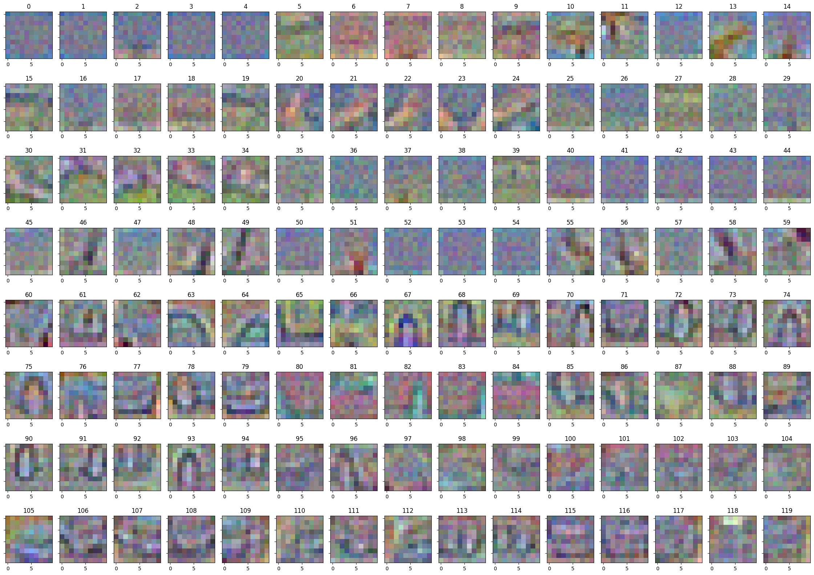


For the 60 initial test images the gradients look like this:

Plane:
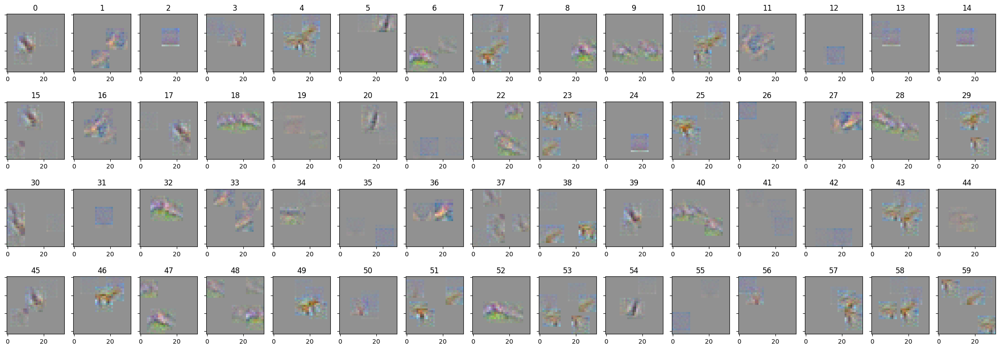

Clean images:
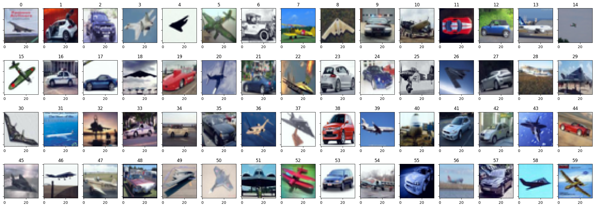

Car:
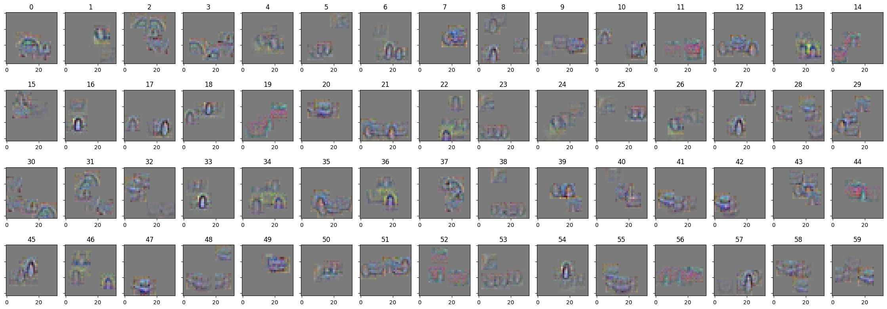

### Simple directional bias

The Conjunction-Disjunction model looks promising but there is a clearly visible problem - we loose the spatial relations between parts. This inspires the following improved architecture which roughtly implements directional invariance (achieving 94% accuracy):

```python
nn.Sequential(
    OrderedDict(
        [
            ("conv1", nn.Conv2d(cfg["n_channels"], 120, 10, stride=2, padding=0)),
            ("mp1", nn.MaxPool2d(3)),
            ("bn1", nn.BatchNorm2d(120)),
            ("act1", nn.GELU()),
            ("conv2", nn.Conv2d(120, 120, 4, stride=1)),
            ("amp1", nn.AdaptiveMaxPool2d((1, 1))),
            ("flatten", nn.Flatten(1)),
            ("smpool", SoftMaxPool(cfg["n_classes"])),
            ("scale", Scale()),
        ]
    )
)
```

Let's take a look at the gradients:

Plane:
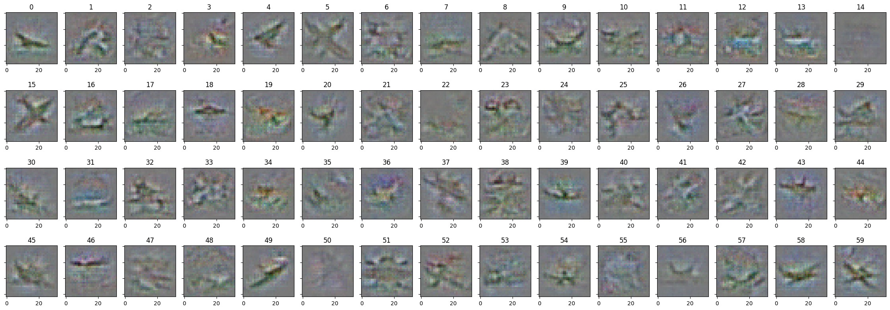

Clean images:


Car:
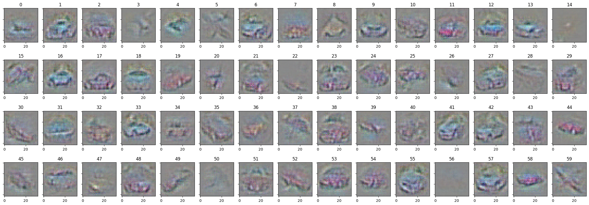

This looks much better but still there is a lot work to do. I think the next layer should be the GumbelConvolution.

### GumbelConvolution

The GumbelConvolution might be usefull here after all as it encodes an intuitive reasoning process. To recap, this is a Convolution with every kernel (output feature) attending to only one input channel per spatial dimension. GumbelConvolution requires more refined training procedure than I initially thought - we have to force the gumbel distribution to approximate more and more closely the one-hot vector as the training  progresses. This seems crucial for allowing the model to actually choose the one channel and may provide benefits - if not for accuracy, then probably for (gradient) interpretability.

## 05.08.2024 - 12.08.2024

Mostly technical week both in terms of code and defining proper learning strategy. I think I'm starting to make the GumbelConvolutions work but I'm not there yet. There are glimpses of interesting level of interpretability.

## 12.08.2024 - 19.08.2024

I'm convinced that GumbelConvolution + SoftMaxPool are the way to go. They allow for designing fully interpretable neural network architectures. A simple example is this:

```python
            ("conv1", nn.Conv2d(cfg["n_channels"], 120, 10, stride=1, padding=0)),
            ("mp1", nn.MaxPool2d(5, padding=2, stride=10)),
            ("bn1", nn.BatchNorm2d(120)),
            ("act1", nn.GELU()),
            ("conv3", GumbelConv(120, 60, 3, stride=1, hard=True)),
            ("amp1", nn.AdaptiveMaxPool2d((1, 1))),
            ("flatten", nn.Flatten(1)),
            ("smpool", SoftMaxPool(cfg["n_classes"])),
            ("scale", Scale()),
```

Every gumbel unit (output unit of the 3x3 GumbelConv) selects one input filter per spatial location. Every input filter is easily visualizable as it corresponds to a 10x10 image patch. The MaxPooling layer is designed so that patches don't overlap too much (to avoid obscure interactions of filters). To visualize the gumbel unit we compute its gradient on a few samples of Gaussian noise input images. Here is such a sample for gumbel unit no. 59:

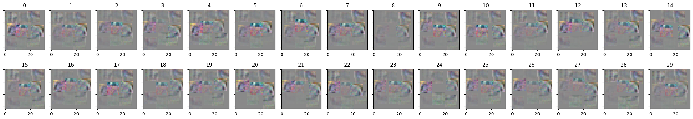

I think that gradient alignment on Gaussian noise is a way better tool for assessing model interpretability then gradient alignment of natural images. It has two benefits:
- global interpretation of unit activation patterns (not dependent on particular input)
- sanity check - as even simple edge detectors have very nice gradients on natural images

Further work includes designing architectures with higher-resolution Gaussian-noise gradients, probably by stacking more GumbelConvolutions together.

## 19.08.2024 - 26.08.2024

I experimented with 3 layer GumbelConvolutions to make the gradients more detailed. The initial results prompted me to implement generalised version of GumbelConv - one that can look at more than 1 input channel per spatial dimension of the kernel. After some reading and thought I decided to implement it in a pretty straightforward way, sligthly changing the implementation of torch.nn.functional.gumbel_softmax to take topk elements instead of max. I have yet to test if this can help with improving the results.

It's quite apparent that we need to find a proper bias-variance trade-off and the topk parameter seems to be a good candidate here. Small value of topk corresponds to a large inductive bias whereas large values to larger sensitivity of the filters. If the filters are oversensitive (high variance) then the gradients will be noisy; if they are biased then the gradients will be stable but not very expressive. Therefore it seems that we should aim to strike the balance between the stability and sensitity of network filters. Probably the bias should increase with the depth of the layer - lower layers should be more sensitive while deeper layers - more biased.

The networks I'm considering are quite simple but the interpretability of 2 layer network suggests that there is something interesting going on (it's not trivial to make 2-layer network fully interpretable). If I can figure out how to increase the resolution and variance of gradients by adding more layers then I think I will essentially solve computer vision, which is quite exciting. On the other hand this observation alone might indicate that it can be a difficult step.

## 26.08.2024 - 02.09.2024

It seems that mixing more channels in the GumbelConv is NOT the way to go. I failed to make the networks more interpretable that way. The gradients are too noisy and don't encode enough inductive bias. These experiments suggests that standard ConvNets (which are a corner case of GumbelConvs) are just glorified edge detectors that do classification based on counting low-level structures (e.g. class-specific edges or textures) and hardly incorporate any high-level spatial correlations.

I think I should experiment more with the ideas I developed in my recent paper, i.e. semantic features. I'm starting to see a general way of building white box neural network architectures. Basically an output unit of a layer should be a disjunction over the variants of the unit. Disjunction is implemented by SoftMaxPooling. The variants of the unit could be different types or poses of on object or a part of the object (i.e. a wheel of a car). To avoid just a few variants dominating the others we add a BatchNorm layer. Such a network basically performs clustering (every unit is an average of the training examples in its cluster). Now, every variant is itself a semantic feature as defined in my paper, i.e. it's MaxPooled over it's local variations (e.g. small translations of affine/projective transformations). Every variation of the variant is just a linear combination of lower-level features. In particular this can be a GumbelConvolution with just one input channel per spatial dimension. The lower-level layer is build in the same way. 

For example a convolutional classifier consisting of 2 such layers could be interpreted as a disjunction over different variants of objects with every variant defining a spatial relations between parts; the parts are themselves disjunctions of their variants. The tricky part is to make the parts indeed encode the variants of the same semantic entity, e.g. the car should have wheels and the wheel should be a disjunction over various types of wheel.

The parts of the objects in the CIFAR10 dataset should be invariant to small projective transformations, small scale changes and the change of colour palette (optionally different colors could be represented by different units). However I have an idea how to implement the semantic consistency of (variants of) parts in a more general way using standard augmentations and a form of self-supervised learning. Basically the activation of the object-level variants should be invariant over identity-preserving augmentations.

The approach I'm taking here may seem complicated as I introduce several novel notions; however it's a pretty straightforward approach to neural networks and I can almost see a proof that it must work - I build shallow models but take extreme care for the interpretability. I'm almost afraid this approach is too straightforward to work well on harder problems and perhaps is a well-known folklore in the AI community but it's probably not - if one takes into account the disappointing state of academic research marred by the short-term optimisation for citations. The time and further experiments will tell. Anyway it's a fascinating adventure.

## 02.09.2024 - 09.09.2024

This week I've been figuring out the implementation details as there are many moving parts in what I want to do and without proper hyperparameter alignment I could waste a lot of time on failed experiments. I think I got all of the details figured out and I'm ready to put it all together.

Following up on the last weeks sketch of the proposed architecture here are the details:

Object-part local biases (invariance over small local transformations of object parts):

- fixed translations (this is for free in Conv2d + MaxPool2d)
- fixed scale (we will scale the convolutional kernels to encode object-part scale invariance)
- learnable perspective transforms (use [kornia.geometry.transform.warp_perspective](https://kornia.readthedocs.io/en/stable/geometry.transform.html#kornia.geometry.transform.warp_perspective) with learnable matrix; however only the M_{11} and M_{12} matrix coordinates should be learnable as they encode the rigid 3D perspective change; also the matrix M should be multiplied by translation matrices to center the perspective warp around the center of the image and not around the upper left corner)

Object-part variants (non-local variants of object-parts) learned by self-supervision - keeping the maximal values of groups in the penultimate layer constant during training for the augmented variants of the input; we will use the following augmentations from [kornia.augmentation](https://kornia.readthedocs.io/en/latest/augmentation.module.html):
- ColorJiggle
- RandomChannelShuffle

This will allow us to make most of the natural variants of parts activating the single unit in the first layer. Therefore the following layer can be a GumbelConv layer with just one input channel per spatial dimension. This will naturally boost interpretability and the expressive power while keeping the network architecture simple and entirery white box.

The implementation will be based on the [sf_layers](https://github.com/314-Foundation/white-box-nn/blob/main/lib/modules/sf_layers.py) from my last paper, in particular on the ConvLayer. This is very exciting as it turns out that this work incidentally will be a direct continuation of the ideas developed in my paper but for CIFAR10 (which should be harder to dismiss than in the case of MNIST). The approach has matured a lot in the past months and a lot of technical machinery has been developed.

## 09.09.2024 - 16.09.2024

I've implemented the perspective and scale invariant convolutions. However the first results are disappointing - there is no substantial boost neither in interpretability nor in the accuracy.

One day I've spontaneously revisited the past experiments and I've noticed that restraining weights of intermediate GumeblConvs to positive values considerably boosts interpretability (but slightly lowers accuracy). Today I also realised that I don't need GumbelConvs for that and standard Conv2d layers restricted to positive values also show this level of interpretability (provided that the penultimate layer is SoftMaxPool as before). My initial thoughts are that such training regime forces the positive decision process as well as favours weight sparsity - both seem to be relevant for interpretability.

The gradients on test data look nice (gradients on the same inputs - towards cars and planes respectively):

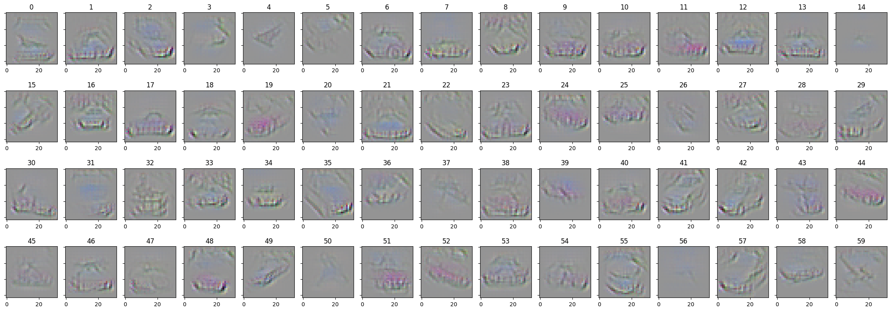

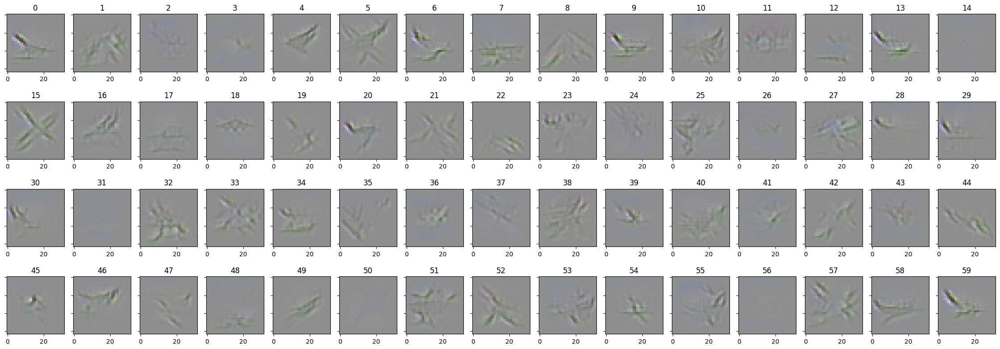

Gradients of units in the penultimate layer on noise look worse but are still intelligible:

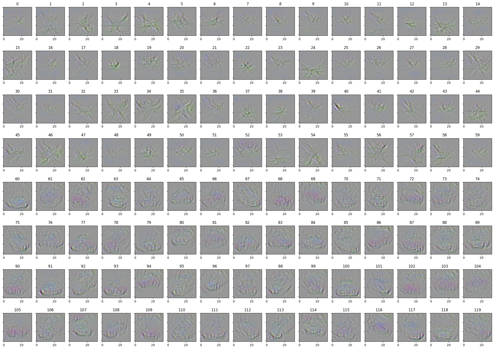

This looks to be the most promising direction for now.

## 16.09.2024 - 23.09.2024

This week I've been experimenting with positively-constrained convolutions. The constraint boosts gradient alignment of hidden units regardless of network depth which gives full insight into network actions (even if the gradients are computed on noise). This resembles the Guided Backpropagation but is more theoretically sound and faithful to the network's decision process. In particular I can experiment with the network architecture and get immediate insight into the effects of particular architectural choices. I can confirm that intermediate layers indeed learn consistent lower-level features.

The general idea is this - use a positively constrained convolutional backbone to encode bias (local variations of objects) and the SoftMaxPool layer to pool over class variance (different objects within a class). The challenge is to boost the sensitivity to class variance and therefore to boost the accuracy. With interpretable gradients this should be just a matter of time. For example I discovered that it's crucial to disable the learned affine rescaling in BatchNormalization layers to effectively use all the available hidden units. The next idea I'm excited about is to (SoftMax)pool over different convolutional backbones as a single architecture seems to be bound to a particular object scale. The less exciting but more obvious one is to use more data augmentations but I will wait until I feel that I've run out of architectural ideas.

I also need to do some refactoring as the approach has simplified over the last two weeks and I can cut off some parts of code while streamlining the others, in particular the ones responsible for gradient visualization. Current approach also allows me to easily scale to deeper architectures and therefore it's more and more important to move to GPU as the training time on my local machine becomes inconvenient (I try to avoid the overhead connected with working on remote machines but that becomes less and less effective). The refactoring will make the transition easier. Although the https://lightning.ai/ environment allows me to move to remote pretty seamlessly it used to be laggy in the past (but that might have improved in the meantime).

## 23.09.2024 - 30.09.2024

I noticed that the networks I train don't fully utilise the capacity of the first convolutional layer - there are always some dead units. I tried to fix that by adding some noise during training but to no avail. However this seems to be a minor problem and I think I've spent too much time on it.

I started experiments on 3 classes and realised that setting affine=False in the last BatchNorm layer was important for two classes but for 3 classes it doesn't make a big difference - the results are even better with affine=True. This is a reminder that I should be wary not to overfit my findings to a particular oversimplified setting and test on harder problems sooner.

I visualized activation patterns of all hidden layer units for a 4-layer VGG-like network with positively constrained convolutional weights and the results are underwhelming - the features are of really bad quality. I think this is not the problem with the visualization but rather with the architecture - the initial 3x3 convs produce a lot of noise and the next layers focus on low-level local signals instead of global patterns. Going deeper doesn't seem to be a good idea in terms of interpretability.

The insights I made while inspecting gradients suggest that the architectures should be designed in a top-down manner - the last layer is the main organiser of the activation patterns. Lower layers just follow what the top one dictates and adding more lower layers doesn't bring too much value - 3 or even 2 layers should be enough. It's more important to focus on the design of the last layer, e.g. it can represent the entire image or just a smaller sliding window - the sliding window is more adequate for capturing smaller-scale objects. Thus it seems that the ensemble of different shallow models is the way to go.

### Mechanistic interpretability

"Mechanistic interpretability" (of computer vision models) is definitely a fitting keyword here. Basically I try to design a mechanistically interpretable classifier for CIFAR10. I think my approach additionally puts some "simplicity" constraints on the mechanistic explanation as the decision process is required to be "positive", i.e. the network should not use negation, just a mix of "spatially organised" conjunctions and disjunctions. Recently I've been thinking more and more in terms of a locality-sensitive hashing, because what I do is basically assigning a group of buckets per class and using the backbone shallow convnet as a hashing function that maps visually similar inputs to the same bucket. My recent idea to do the ensemble of different models can be reformulated as a simple observation - in principle every bucket could have a unique hashing function, i.e. a unique backbone. This actually could boost the otherwise restricted expressive power of the positive decision process.

## 30.09.2024 - 07.10.2024

I experimented with various "parallel" convolutional architectures as described in the last update (i.e. a "parallel layer" consists of a list of standard layers with matching outputs; their outputs are simply concatenated into the output of the whole parallel layer). I tried different weight-sharing strategies with the extreme case being the SoftMaxPool over N copies of a base neural network (with different initializations). Other designs included sharing the first layers but computing convolutions of different scales in the following layers. The interpretations were consistent with the designs (provided that the convolutions were positively-constrained, as before; otherwise the gradients were noisy). However, both the accuracy and the gradient quality seemed to be worse than those of the baseline architecture (I tried to keep the rough number of learnable params the same across different designs). Sharing network layers across different output units as done in the standard architecture seems to be beneficial in comparison to the parallelised designs - as the lower-level features become more sparse, more general and of higher resolution.

The experiments I made were far from exhaustive. In particular I think that it will be worth revisiting the design with different convolutional scales in the future but for now I concluded that the potential benefits would be marginal. I'm looking for a solution that would present a significant improvement to the gradient quality and the accuracy and I failed to discover such a direction while experimenting with parallel network layers.

That made me rethink the basics - what allows the positively-constrained convolutional architecture to generalise to unseen examples? It seems that the MaxPool2d layers must be the answer. As the gradients show, the network learns to combine spatially-arranged features into objects in particular poses. The MaxPool2d layers allow for some "wiggle room" for the locations of the lower-level parts. In particular in the 2-layer conv-net the second layer defines the rough spatial structure of the local features and the first layer defines the local features themselves. How to make this design generalise better? I think that I could try to somehow expand the wiggle-room of the parts, but preferably in a general and/or learnable way so that I wouldn't have to design this "wiggle space" by hand. This is actually a revisit of the ideas I had before, i.e. the semantic features. But those experiments were conducted for the GumbelConvolutions, which were significantly harder to train than the PositiveConvolutions (positively-constrained) I arrived at in the meantime. I think this is a good moment to revisit those ideas and this work will be done in the following week.

## 07.10.2024 - 14.10.2024

As mentioned last week I tried to increase the expressive power of representation-layer units by increasing the inductive bias of parts, i.e. while every unit in the representation layer represents some configuration of parts-at-locations, I tried to increase the broadly understood "wiggle room" of parts. I failed to increase the accuracy and the quality of gradients. The learnable variants of parts turn out to be mostly the copies of the base variant.

Further experimentation led to me believe that boosting the inductive bias of representation units might actually be a wrong direction here. It looks like the problem is exactly the opposite, i.e. the representation-layer units are matching too broadly to many different variants of the object. The network underutilises it's weights and the representation units are too similar to each other. It seems I should rather be increasing the diversity of representation units now - instead of their expressive power. Only after I'm able to optimally use the network's width (unit diversity) should I increase the individual unit's expressive power (increase network's depth).

This led me to re-examine the BatchNorm layer which is the main factor in making the representation units more diverse - without any form of normalization the representation layer tends to be dominated by just a few most strongly activating units. I researched some work that tried to improve the BatchNorm layer. In particular the [Decorrelated Batch Normalization](https://arxiv.org/abs/1804.08450) and [Iterative Normalization](https://arxiv.org/abs/1904.03441) papers seem especially interesting for my setting, i.e. apart from just batch-normalizing the representation units I should decorrelate them to increase their diversity. In other words the idea is to apply whitening to the layer output in the hope of utilising the set of output units fully and making them as diverse as possible. This can also be applied in the former layers to force the variants of parts to be distinct and not just copies of a base variant. I will experiment with the whitening transformation next week.

## 14.10.2024 - 21.10.2024:

As mentioned last week I tested the Iterative Normalization (which is a more refined form of Decorrelated Batch Normalisation) applied to the representation layer. This made both representation quality and accuracy worse. Thus, it seems that decorrelating representation units does not help the representation quality. I tried various ways to incorporate the Iterative Normalization into the architecture but saw no promising improvements.

Then I hypothesised that I could improve Batch Normalization in another way, i.e. force units to focus only on the top percentile of activations inside the batch (I called it Percentile Normalization). In this way there would be no unit that would dominate the representation as the batch activations would be spread evenly across the representation layer - every unit could be matched to at most k% of examples. This would ensure higher variation across the representation units.

As a result, the unit representations were indeed more "spread out" but that did not improve their quality nor the network accuracy - the representation units were more diverse but those additional variants were essentially duplicates. There was no discernible increase in gradient quality. Combining this with Iterative Normalisation did not help either.

Overall, the standard Batch Normalisation performed the best among the normalization approaches I tested. I suspect that the bottleneck I'm facing is actually poor inductive bias after all - even if I can normalise the activations perfectly the filters might still be too rigid to be matched efficiently across possible variations of inputs and matching too broadly to undesired examples.

Eventually this week's experiments have led me to design a surprisingly straightforward way to add substantial inductive bias into my architecture - simply augment the inputs and then take maximum match across all augmentations of the particular input. This is the first time for weeks that I can clearly see the improvement in the gradient quality! Additionally, the method seems to be easily scalable to more augmentations, bearing promise for improving the gradient quality even further. In particular, I've got an idea how to incorporate color-space invariance into the first layer - this has been elusive for me for the last few months. I will see if proper color-invariance can indeed boost gradient quality next week.

I'm also crystallizing my approach, understanding more and more clearly how every design choice fits in the larger picture - the working name for the proposed architecture is Interpretable Neural Hashing. I've got that outlined in more detail but in short the idea is to memoise the training dataset into a collection of slots (representation units) using a neural network as a hashing function; up to identity-preserving augmentations. Additionally, the gradients of the slots have to be interpretable (perceptually aligned) and stable, i.e. have similar visual properties regardless of the input (even on noise). Intuitively, every slot should correspond to exactly one variant of the input (exactly one type of object) - up to augmentations.

Here is a visualisation of 180 slots learned for 3 first CIFAR classes (plane, car, bird), the gradients towards every slot are computed on gaussian noise:

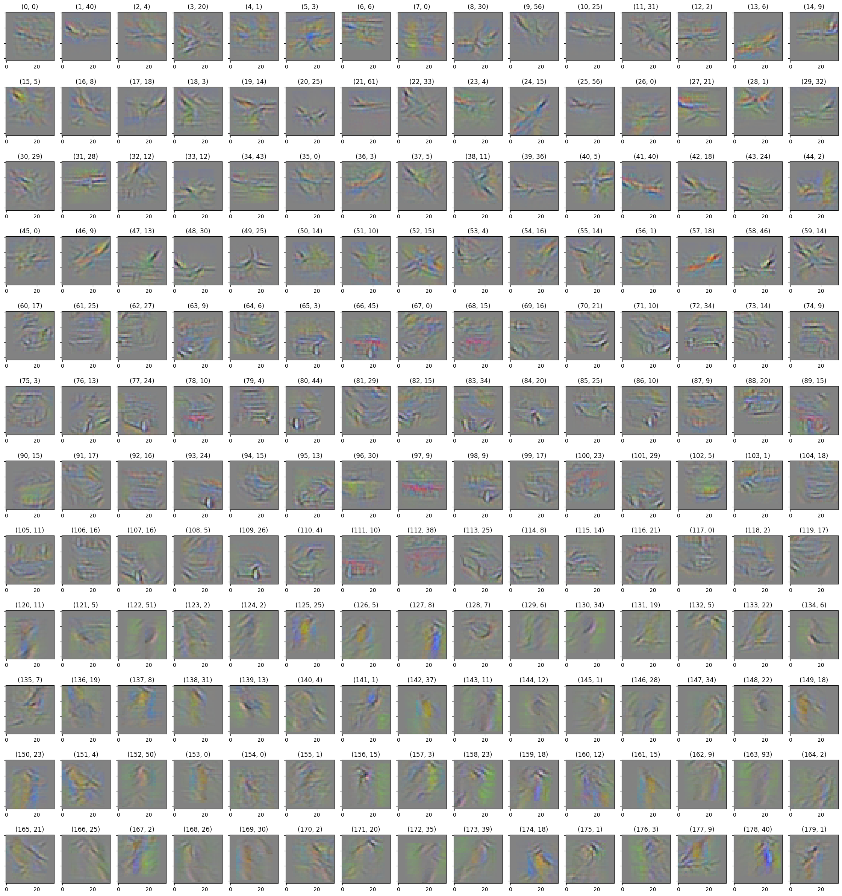

## 21.10.2024 - 28.10.2024:

I’ve researched various input augmentations for slot-invariance - both colour and spatial (perspective) augmentations. The improvements seem very modest compared to the required computational overhead.

I realised that one has to be very cautious with the input-augmentations as they can boost irrelevant input features (e.g. the background), making it easier to match low-quality slots and not promoting slot quality enough during training. For example, warping perspective of an image of a bird can boost the green background, which in turn matches with low quality slot that recognises some low-resolution arrangement of green squares. However, I might not have chosen the set of augmentations optimally.

One of my working hypotheses is that I should stick to (approximate) local isometries. In particular, I tried a set of small rotations (by +/-15 degrees followed by optional horizontal flip). This does not reduce the accuracy (but neither increases it) and seems to regularize the slot interpretations moderately - the latter is subjective but the slot interpretations seem to be more "horizontally aligned" as one might have expected. However, the difference is indeed negligible if any. Here are the slot visualizations to compare with last week's:

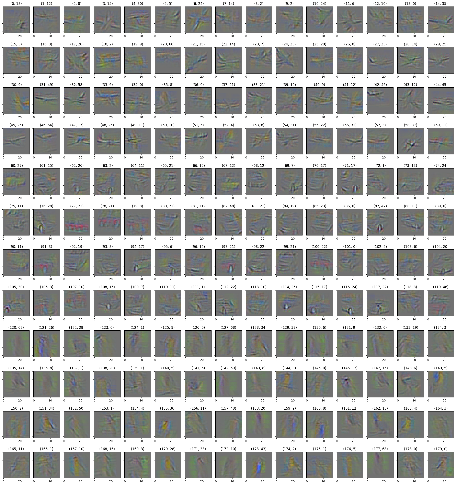

Another interesting idea here would be to consider 3D local isometries of objects (camera changes) as a better alternative to 2D perspective warps of object images (thus reducing the impact of the background). This would require encoding the learnable depth-channel in the slot representations and also a set of differentiable projections on 2D space - so that the learned internal representations are actually "2.5 D" entities that can be viewed from different angles (and those angles can later be matched against the 2D inputs). This seems feasible but potentially tricky to implement. Another way to do this would be to switch to a different dataset that actually allows for 3D input augmentations. However, in my current estimation, the latter option rises too many methodological problems (e.g. I'd have to prove to the community that the problem is not "too easy").

As a sidenote here, I've checked many ideas and different directions in the recent time. Despite most of them not showing the expected improvements I actually think that it does not necessarily mean that those are not "the right" directions - there are many hyperparameters that describe the proposed solutions. It might be that the various improvements won't work in separation but have to "click" together to present a meaningful advancement. For example, it might be that one has to choose an entire set of input augmentations (both perspective, color and some other types) together with the appropriate architecture for different components to work together and unleash their holistic potential. I will try to find such compatible sets of architectural improvements in the near future.

### The yin and yang of learning: point separation vs point identification (expressive power vs inductive bias)

Even more formally, I have to balance the two complementary aspects of the learning procedure. The model obviously has to be expressive enough to separate points from different classes. On the other hand, it has to generalise i.e. glue together certain sets of points (with the help of the inductive bias). In particular, the diminishing returns I get from boosting the inductive bias in my architectures suggest that I should work more on their separation capabilities. I tried to do this before by playing with different variants of batch normalisation but now I think that this was unlikely to work - if a slot scores one input lower then the other incorrectly, then no form of normalisation will help (as this is a monotonic transformation). Instead of normalising the scores I should do something that can swap the incorrect ordering of scores. One of the most natural ideas is to do (input-weighted) subtraction.

Indeed, restricting the convolutional weights to positive values boosted gradient alignment considerably but also reduced the expressive power. The aligned gradients are due to the resulting positive decision process and the induced sparsity of learned weights - both of them increase the stability of gradients across different inputs (including random noise). It's interesting to try to introduce more expressive power with the help of the negative decision process, while still retaining the gradient alignment. In other words, I could try to disentangle the positive and negative reasoning into separate branches and glue them together in a controlled way. Throwing in a non-linearity could probably boost the expressive power even when compared to the unrestricted convolutional networks, as the positive and negative branch won't be simply added together. I shall play around with this idea and see what happens.

## 28.10.2024 - 04.11.2024:

I added the negative decision process to the architecture. There is a slight improvement in accuracy but nothing substantial. Moreover, the gradients toward negative units are rather trivial - features that lower the score of a given class are simply the features that boost either of the remaining classes. Thus, I can see no substantial benefits to the interpretability; the negative component makes the network more complex and the benefits to the accuracy seem marginal.

I might revisit this in the future but right now I'd like to explore the other thing I was excited about last week, i.e. to explore a 3-dimensional inductive bias. This might be a more appropriate approach after all as boosting the network's ability to separate points in a generic way generally contributes rather to better train memoization than to better generalisation.

The objects in the CIFAR datasets are 3-dimensional therefore I think that the good inductive bias has to account for that. I plan to add a depth dimension to the learnable convolutional kernels, treating them as 3-dimensional template features - and simply project the 3D kernel to 2D kernel in a few different ways to achieve various views of the 3D kernel. Hence, the 3D kernel defines a set of 2D kernels but with intricately connected weights in a way that mirrors the connection of different views of a 3D object, which seems to be an appropriate bias here. I've already made sure that there are tools to do just that in the kornia library and I will do the first experiments soon.

## 04.10.2024 - 11.11.2024:

I don't have much to report this week. I've implemented the ProjectiveConv2d which encodes the 3D projective bias - as mentioned last week. The implementation was tricky in some places and took longer then expected but it should work ok now. I should be able to start the experiments tomorrow.

## 11.11.2024 - 18.11.2024:

I tested the ProjectiveConv2d. This approach offers many possibilities and I definitely haven't tested all of them - there are many ways to project a 3D representation on the 2D space. I decided to rotate the 3D representation along the x and y axis by a certain acute angle in 8 directions - this corresponds to shifting the viewpoint slightly to see the sides of the object.

The results were inconsistent even across similar sets of parameters. Some offered slight improvements while others decreased the metrics. This approach also introduces significant overhead as it makes the training 8x slower. Inspecting the representations revealed that the 3D representation was mostly redundant as usually only one 2D view was relevant. Perhaps there are ways to make the 3D representation useful but I started to rethink my approach.

From a certain perspective tweaking the inductive bias is just a technical detail. I realised that I need to focus on the larger picture. What I did so far is to design an interpretable neural hashing procedure. This is in it of itself a novel design that deserves better scrutiny. In particular, it naturally lends itself to a continual learning paradigm and inspires a different training procedure.

Even if my method won't achieve good test time accuracy on CIFAR it can still excel in different areas. Doing interpretable continual compression of inflowing data with no catastrophic forgetting is actually a pretty exciting thing to do and I realised that this can be achieved by neural hashing. After the model encounters the new data it either assigns it to the matching slot or, if there is no good match, creates a new slot and expands its representation space.

Instead of evaluating test-time accuracy I can propose a different metric - "accuracy after slot update", i.e. I will do one pass through the (unlabelled) test set and filter examples that aren't matched to any of the slots. I will then check the labels of those examples and add new corresponding slots to the network. Then I can compute the accuracy in the next pass. This setting seems better-suited for real-world scenarios than the standard train-test evaluation paradigm. Ideally, the amount of new slots should be low and the new metric I propose is this: how many new slots need to be added to achieve a desired accuracy.

In essence, this is an assignment problem - every example in a batch of data has to be assigned to exactly one slot (existing or new one). Every slot has its assigned label. The goal is to make every slot a high-precision detector of the label. Therefore the entire layer becomes an ensemble of high-precision label detectors. If some examples are left unassigned then I create an appropriate new slot. We'll see how the implementation will go but I think I've figured out most details.

Thus want I think I can do is roughly this:

- Plug & Play module - can be applied to representation space of any backbone architecture (in place of the linear probe).
- Easily detects out-of-distribution data (if no slot is matched)
- Naturally robust to adversarial attacks (adversaries should be out-of-distribution)
- Learns continually (slots are added incrementally)
- No catastrophic forgetting - by design (previous slots are not removed)
- Works well even for very simple backbone architectures (we'll see but the "accuracy after slot update" can be high)
- Can be made interpretable with the right backbone (as I've shown so far)
- Ensemble of high-precision label detectors (slots)
- Slots can be made invariant to arbitrary fixed input augmentations (similar to TTA)
- Backbone should encode local invariance of objects (inductive bias)
- Slots help the backbone to separate classes

## 18.11.2024 - 25.11.2024

Some good old programming this week - nothing too difficult but quite detailed. I've implemented the core functions for the incremental slot-matching mechanism. Have to wrap them up into procedures and do some code cleaning before I can run experiments.

## 25.11.2024 - 02.12.2024

The implementation turns out to be quite demanding. No part is particularly difficult but orchestrating them together requires a lot of care and foresight so that the resulting module is designed well enough to allow for flexible and robust experimentation. It even inspired some nice refactoring of the existing codebase. I think I'm almost there but certainly this takes longer than expected.

## 02.12.2024 - 09.12.2024

I've implemented most of the IncrementalNeuralHashing layer

I've been really humbled by this task. Often I felt that my brain could use more working memory to grasp all the relevant details together so that the code is correct and concise and not an unmanageable mess. Proper understanding of what I really want to do at every step was crucial as it allowed me to simplify the implementation enough to actually carry it out. Even then every non-trivial line of code required careful scrutiny and longish variable names such as `thresholded_bs_scores_normalized` to keep track of things.

In particular, the layer had to account for various backbones and input augmentations to allow for robust experimentation. Tensors had to be L2 normalised and unnormalised appropriately for proper threshold computation and efficient gradient propagation. The optimiser had to be re-initialised after every expansion of the weight matrix and therefore preferably stateless (so I chose the classic SGD without momentum - for this layer only). The weight matrix should be pruned after every epoch to eliminate dead slots. The slot-threshold estimation was a complex tensor-manipulation task on its own and now has to be fitted appropriately in the training loop. There were many other minor architectural/technical decisions I had to evaluate to make the resulting implementation reasonably straightforward and easy to work with.

Things left to do, they seem quite basic:
- select the unmatched examples (actually their variants with maximum norm), normalize them and treat them as potential new slots
- compute their 100% precision thresholds on the current batch (treating them as class detectors) - this is tricky but I already have a function for this so it should be easy to fit in
- select the minimal set of those slots as new slots
- add the new slots to their respective classes
- concat new slots with the old slots, replace the weight and the optimizer
- check if the gradients are preserved; if not, redo the forward pass (don't optimise for performance just yet)
- update other buffers: threshold, n_slots_per_class, n_slot_activations_per_epoch

Plan for later:
- test for bugs
- test on MNIST and see how many slots are added after training
- test the accuracy
- add the minimum set of unmatched test examples as new slots and test the accuracy again (continual learnig)
- test on CIFAR with the interpretable backbone
- check hyperparams such as: 
    - use (batch thresholds) vs (running averages of thresholds) during training (batch thresholds mean positive gradients only)
    - MaxPool vs SoftMaxPool for pooling slot values along the classes
    - initial values of layer params (such as scale)

## 09.12.2024 - 17.12.2024

I've finished implementing the IncrementalNeuralHashing layer, the class has ~300 lines of non-trivial tensor manipulation code and I'm really glad that this technical work is done. It should work fine as I tested relevant parts of the code along the way and the architecture is carefully thought out. Perhaps I should write some unit tests, but I don't want to postpone the experiments too much and such tests are non-that-trivial for tensors. I want to refactor the code a little by extracting a SlotMatcher class that would encapsulate some repetitive computations and make the code easier to use but that is quite straightforward now. It was really hard to wrap my mind around all the details and different scenarios (i.e. training, testing, detecting and adding new slots during training, detecting unmatched examples during eval etc.). I'm excited to start tests now.

The layer should have a nice property - in the worst case it should memoize all the training examples. This would imply poor inductive bias of the backbone. The better the backbone inductive bias, the better the data compression done by the hashing layer. This would be the opposite of a linear layer that just computes an average of class representations in the worst case scenario (where one output unit dominates the others).

## 17.12.2024 - 23.12.2024

I've spent a few days refactoring but it was well worth it. The code got much cleaner, I understood the problem deeper and made some functional improvements. There were some minor bugs in the code but I think I fixed them all. The layer works as expected on MNIST but I'm not very far into experiments just yet (I use MNIST before CIFAR to get a better understanding of the behaviour of the proposed layer).

More importantly I realised that the slot selection I'm performing is an instance of the classic "set cover problem". This allowed me to select much better sets of slots during training. I've re-implemented the well-known greedy approximation as matrix operation in Pytorch for even better performance.

Somehow I feel it's a very good sign to have an NP-hard problem in the core of the proposed learning algorithm - intuitively speaking, learning *should* be computationally hard. In fact, learning can be indeed considered an instance of the set cover problem - you cover observations with the least possible amount of ideas. The fact that this rather philosophical observation is a consequence of technical work is pretty encouraging and it really feels I'm on to something interesting.

## 23.12.2024 - 30.12.2024

In the spare time I had during the holiday season I made more experiments, tests, thinking and some crucial technical improvements to the algorithm. This is the best piece of code I've ever written - I'm really proud to have captured all that complexity in an elegant and manageable way - the hard work has paid off. There's also a compelling theory behind all the stuff which I started to describe formally. The Preliminary experiments on MNIST suggest that it works just like I hoped it would - even the simplest architecture turns out to be accurate and interpretable despite minimal hyperparameter tweaking. I can also see that it can easily detect errors in data and got possible new insights to adversarial vulnerability. We'll see if this transfers to CIFAR. But even if it doesn't (which I find unlikely) I think I have enough material for a very interesting paper.

I've also done some reading on [neural cirtuits](https://distill.pub/2020/circuits/) and sketched the introductory chapters of the paper (Introduction + Related Work) - this might be a little premature but I felt it was a good moment to take a little pause and look at a broader perspective before I dive back into technical work.
